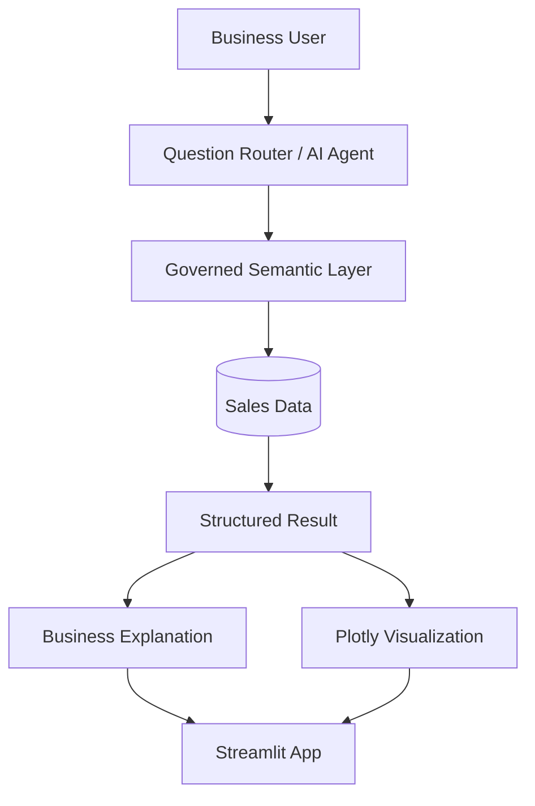

# MetricMind Architecture

```mermaid
flowchart TD
    U[Business User] --> A[Question Router / AI Agent]
    A --> S[Governed Semantic Layer]
    S --> D[(Sales Data)]
    D --> R[Structured Result]
    R --> E[Business Explanation]
    R --> V[Plotly Visualization]
    E --> UI[Streamlit App]
    V --> UI
```
